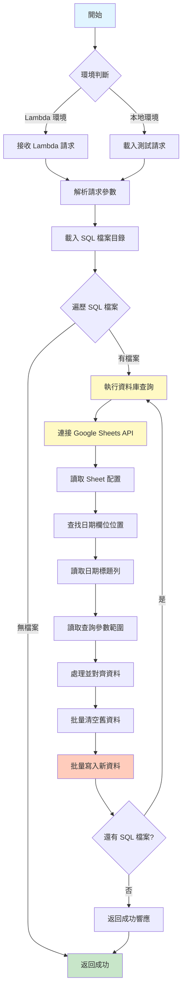
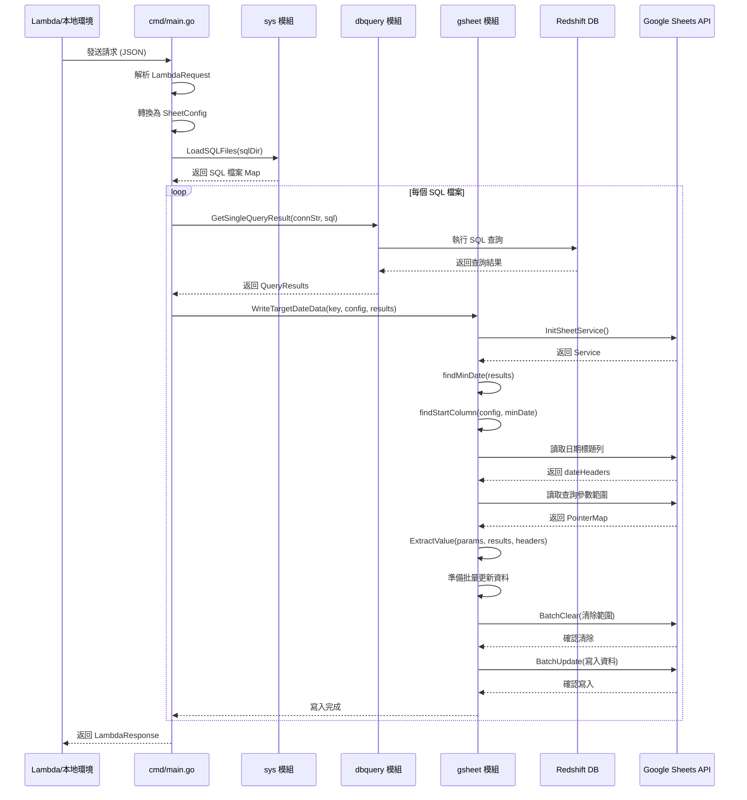

## 📋 目錄

- [專案簡介](#專案簡介)
- [功能特色](#功能特色)
- [系統架構](#系統架構)
- [高層次流程圖](#高層次流程圖)
- [單元互動流程圖](#單元互動流程圖)
- [專案結構](#專案結構)
- [環境需求](#環境需求)
- [安裝與設定](#安裝與設定)
- [使用方式](#使用方式)
- [配置說明](#配置說明)
- [部署](#部署)

## 專案簡介

GSheet Report 是一個基於 Go 語言開發的 AWS Lambda 函數，主要功能是：

1. 從指定的 SQL 檔案目錄讀取查詢語句
2. 連接到資料庫執行查詢
3. 將查詢結果自動更新到 Google Sheets
4. 支援動態日期欄位對齊和批量寫入

## 功能特色

- ✅ **自動化報表更新**：定期執行 SQL 查詢並更新 Google Sheets
- ✅ **多 SQL 檔案支援**：支援一次處理多個 SQL 檔案
- ✅ **動態日期對齊**：自動識別 Sheet 中的日期欄位並對齊資料
- ✅ **批量寫入優化**：使用 Google Sheets API 批量操作提升效能
- ✅ **環境自動判斷**：自動識別 Lambda 或本地環境
- ✅ **配置化設計**：透過請求參數動態配置 Sheet 設定

## 高層次流程圖


```mermaid
graph TD
    A[開始] --> B{環境判斷}
    B -->|Lambda 環境| C[接收 Lambda 請求]
    B -->|本地環境| D[載入測試請求]
    
    C --> E[解析請求參數]
    D --> E
    
    E --> F[載入 SQL 檔案目錄]
    F --> G{遍歷 SQL 檔案}
    
    G -->|有檔案| H[執行資料庫查詢]
    G -->|無檔案| Z[返回成功]
    
    H --> I[連接 Google Sheets API]
    I --> J[讀取 Sheet 配置]
    J --> K[查找日期欄位位置]
    K --> L[讀取日期標題列]
    L --> M[讀取查詢參數範圍]
    M --> N[處理並對齊資料]
    N --> O[批量清空舊資料]
    O --> P[批量寫入新資料]
    P --> Q{還有 SQL 檔案?}
    
    Q -->|是| H
    Q -->|否| R[返回成功響應]
    R --> Z
    
    style A fill:#e1f5ff
    style Z fill:#c8e6c9
    style H fill:#fff9c4
    style I fill:#fff9c4
    style P fill:#ffccbc
```

## 單元互動流程圖


```mermaid
sequenceDiagram
    participant Lambda as Lambda/本地環境
    participant Main as cmd/main.go
    participant Sys as sys 模組
    participant DB as dbquery 模組
    participant GSheet as gsheet 模組
    participant Redshift as Redshift DB
    participant GoogleAPI as Google Sheets API

    Lambda->>Main: 發送請求 (JSON)
    Main->>Main: 解析 LambdaRequest
    Main->>Main: 轉換為 SheetConfig
    
    Main->>Sys: LoadSQLFiles(sqlDir)
    Sys-->>Main: 返回 SQL 檔案 Map
    
    loop 每個 SQL 檔案
        Main->>DB: GetSingleQueryResult(connStr, sql)
        DB->>Redshift: 執行 SQL 查詢
        Redshift-->>DB: 返回查詢結果
        DB-->>Main: 返回 QueryResults
        
        Main->>GSheet: WriteTargetDateData(key, config, results)
        
        GSheet->>GoogleAPI: InitSheetService()
        GoogleAPI-->>GSheet: 返回 Service
        
        GSheet->>GSheet: findMinDate(results)
        GSheet->>GSheet: findStartColumn(config, minDate)
        GSheet->>GoogleAPI: 讀取日期標題列
        GoogleAPI-->>GSheet: 返回 dateHeaders
        
        GSheet->>GoogleAPI: 讀取查詢參數範圍
        GoogleAPI-->>GSheet: 返回 PointerMap
        
        GSheet->>GSheet: ExtractValue(params, results, headers)
        GSheet->>GSheet: 準備批量更新資料
        
        GSheet->>GoogleAPI: BatchClear(清除範圍)
        GoogleAPI-->>GSheet: 確認清除
        
        GSheet->>GoogleAPI: BatchUpdate(寫入資料)
        GoogleAPI-->>GSheet: 確認寫入
        
        GSheet-->>Main: 寫入完成
    end
    
    Main-->>Lambda: 返回 LambdaResponse
```

## 專案結構

```
GSheet_Report/
├── cmd/
│   └── main.go              # Lambda Handler 和主程式入口
├── dbquery/
│   ├── definitions.go       # 資料查詢相關類型定義
│   └── function.go          # 資料庫查詢函數
├── gsheet/
│   ├── connector.go         # Google Sheets API 連接
│   ├── sheetwriter.go       # Sheet 寫入邏輯
│   ├── utils.go             # 工具函數（日期處理、類型轉換等）
│   └── definitions.go       # Sheet 相關類型定義
├── sys/
│   ├── functions.go         # 系統工具函數（SQL 載入、欄位轉換等）
│   └── config.go            # YAML 產品設定載入器
├── config/                  # 各產品設定（YAML），每個產品一個目錄
│   └── younow/
│       └── config.yaml
├── queries/                 # SQL 查詢檔案，依 <product>/<report>/ 分層
│   └── younow/
│       └── daily/
│           ├── payers.sql
│           └── revenue.sql
├── go.mod                   # Go 模組定義
├── go.sum                   # 依賴版本鎖定
├── deploy.sh                # 部署腳本（依產品執行）
└── README.md                # 本文件
```

## 環境需求

- **Go**: 1.23.2 或更高版本
- **AWS Lambda**: 支援 Go runtime
- **資料庫**: PostgreSQL/Redshift
- **Google Cloud**: Google Sheets API 憑證

## 安裝與設定

### 1. Clone Repo

```bash
git clone https://github.com/JayWithBackPain/GSheet_Report.git
cd GSheet_Report
```

### 2. Download packages

```bash
go mod download
```

### 3. 建立產品的 config.yaml

每個產品的所有設定（含 secret）都集中在 `config/<product>/config.yaml`。
從附帶的範本複製一份開始：

```bash
cp config/younow/config.yaml.example config/younow/config.yaml
# 接著填入 client_id / client_secret / refresh_token / db.conn_str / spreadsheet_id 等
```

**重要：** `config/*/config.yaml` 已被 `.gitignore` 排除（內含 secret）。
要交接給其他人時請**走安全管道**（密碼管理器、AWS Secrets Manager 等），
**不要**把實際 config.yaml 推進 git 或聊天工具。

## 使用方式

### Lambda 環境

Lambda 函數只需要接收 `product` 與 `report`，其餘設定一律由 `config/<product>/config.yaml` 中 `reports.<report>` 決定：

```json
{
  "product": "younow",
  "report": "daily"
}
```

### 本地測試

直接執行 `cmd/main.go`：

```bash
# 預設執行 config/younow/config.yaml 的 daily 報表
go run cmd/main.go

# 透過環境變數切換產品 / 報表
PRODUCT=younow REPORT=weekly go run cmd/main.go
```

程式會自動判斷 Lambda / 本地環境；本地端會用 `PRODUCT`（預設 `younow`）與 `REPORT`（預設 `daily`）構造測試請求。

## 配置說明

### LambdaRequest 參數

| 參數 | 類型 | 說明 | 範例 |
|------|------|------|------|
| `product` | string | 產品識別碼，會對應到 `config/<product>/config.yaml` | `"younow"` |
| `report`  | string | 報表名稱，會對應到 config 中的 `reports.<report>` | `"daily"` |

### 產品設定（`config/<product>/config.yaml`）

一個產品的所有設定（含 secret）集中在這支 YAML，分成「product 層級」（OAuth、DB、Deploy）與「report 層級」（Sheet、SQL）：

```yaml
product: younow

# Google Sheets OAuth credentials（共用同一份產品下所有 reports）
gsheet:
  client_id: "<YOUR_GOOGLE_OAUTH_CLIENT_ID>"
  client_secret: "<YOUR_GOOGLE_OAUTH_CLIENT_SECRET>"
  refresh_token: "<YOUR_REFRESH_TOKEN>"

db:                                 # product 層級：所有 report 共用（report 可 override）
  driver: "postgres"                # postgres / mysql / sqlserver ...（預設 postgres）
  conn_str: "host=... port=5439 user=... password=... dbname=... sslmode=require"

deploy:                             # product 層級：給 deploy.sh 使用
  function_name: "SQLDB-ETL-Pipeline-Younow"
  lambda_role: "arn:aws:iam::xxxxxxxxxxxx:role/SO_ETL_Role"
  architecture: "arm64"
  timeout: 900
  memory_size: 1024
  region: "us-east-1"
  aws_profile: "younow"

reports:                            # 多份報表時，新增一個 key 即可
  daily:
    sheet:
      name: "report"
      spreadsheet_id: "1jaq2OJKUio..."
      write_anchor: 11
      start_search_column: "K2"
      query_parameter_range: "H:J"
    sql:
      dir: "queries/younow/daily"

  # weekly:                       # 同一個 product，不同 report 可指定不同 DB
  #   sheet:
  #     name: "weekly"
  #     spreadsheet_id: "..."
  #     write_anchor: 11
  #     start_search_column: "K2"
  #     query_parameter_range: "H:J"
  #   sql:
  #     dir: "queries/younow/weekly"
  #   db:                         # 選填：不寫就用 product 層的預設
  #     driver: "mysql"
  #     conn_str: "<MYSQL_CONN_STR>"
```

說明：
- `gsheet.*`：Google OAuth 憑證；whole product 共用。**含 secret**，不要 commit。
- `db.driver`：`sql.Open()` 用的 driver 名稱（`postgres` / `mysql` / `sqlserver` …）。未填預設 `postgres`。
- `db.conn_str`：DB 連線字串本體（含帳密），直接寫在 YAML。**含 secret**，不要 commit。
- `db` 可以放在 product 層級（共用預設），也可以放在 `reports.<name>` 層級（該 report 專用）。實際使用時會以 **report 層級 > product 層級** 的順序合併。
- `deploy.*`：給 `deploy.sh` 用的部署設定（Lambda function 名稱、IAM role、AWS profile 等）。
- `reports.<name>.sheet.*`：該份報表的 Google Sheet 寫入設定。
- `reports.<name>.sql.dir`：該份報表的 SQL 目錄，建議放在 `queries/<product>/<report>/` 下。

### Secret 與 git
- `config/*/config.yaml` 已被 `.gitignore` 排除。
- 對應的 `config/*/config.yaml.example` 不含 secret，會被 commit 作為新人 onboard 的範本。
- `deploy.sh` 會把 `config/<product>/` 整個打包進 Lambda zip，因此 secret 透過 zip 直接帶進 Lambda runtime（不再需要 Lambda 環境變數設定）。
- 如果你之前曾把 secret 推進 git，請務必 **rotate** 對應的 DB 密碼、Google OAuth client secret 與 refresh token。

### 新增其他 DB Driver

`db.driver` 在 build 時要對應的 Go driver 已經被 import 才能使用。
若要新增其他 driver，編輯 `cmd/main.go` 的 import 區塊：

```go
import (
    _ "github.com/lib/pq"                 // driver 名稱: "postgres"
    _ "github.com/go-sql-driver/mysql"    // driver 名稱: "mysql"
    _ "github.com/denisenkom/go-mssqldb"  // driver 名稱: "sqlserver"
)
```

對應的套件需要 `go get` 進來，才能在 `config.yaml` 把 `db.driver` 設成該名稱。

### 新增一份新報表（同一產品）

1. 在 `config/<product>/config.yaml` 的 `reports` 下新增一個 key（例如 `weekly`）。
2. 在 `queries/<product>/weekly/` 放該報表的 `.sql` 檔。
3. 觸發 Lambda 時帶 `{ "product": "<product>", "report": "weekly" }`。

### 新增一個新產品

1. 建立 `config/<new_product>/config.yaml.example`（可從 `config/younow/config.yaml.example` 複製後調整）並 commit。
2. 從 example 複製出實際的 `config/<new_product>/config.yaml`（**不會被 commit**），把 secret、conn_str 等填上。
3. 建立 `queries/<new_product>/<report>/` 並放入該報表的 `.sql` 檔。
4. 部署：`./deploy.sh <new_product>`。

### SQL 檔案格式

SQL 檔案放在 `queries/<product>/<report>/`，檔案名稱（不含 `.sql` 副檔名）會作為 `SQLKey` 用於匹配 Sheet 中的查詢參數。

查詢結果必須包含以下欄位：
- `dt`: 日期欄位（time.Time 類型）
- `region`: 地區代碼（string 類型）
- 其他需要寫入的數值欄位

### Google Sheet 格式要求

Sheet 需要包含以下結構：

1. **日期標題列**：在指定的 `start_search_column` 行，包含日期欄位
2. **查詢參數範圍**：在 `query_parameter_range` 範圍內，每行包含：
   - 第 1 欄：SQL Key（對應 SQL 檔案名稱）
   - 第 2 欄：Country Code（可選）
   - 第 3 欄：Column Name（要寫入的欄位名稱）

## 部署

### 使用部署腳本（依產品）

`deploy.sh` 會依 `config/<product>/config.yaml` 內的 `deploy.*` 區塊去呼叫 AWS Lambda：

```bash
./deploy.sh younow
```

腳本會：

1. 讀取 `config/<product>/config.yaml`（需要 `yq` 解析）。
2. 編譯 `bootstrap`（`GOOS=linux GOARCH=<architecture>`）。
3. 將 `bootstrap`、`config/<product>/`、`queries/<product>/` 打包成 `deployed_package_<product>.zip`。
4. 若 Lambda function 不存在則以 `create-function` 建立，存在則以 `update-function-code` 更新。

依賴：
- 安裝 `yq`（macOS：`brew install yq`）。
- 已設定對應 AWS profile（若 `deploy.aws_profile` 有值）。

## 開發說明

### 模組職責

- **cmd/main.go**: 
  - Lambda Handler 入口
  - 請求解析和路由
  - 環境判斷

- **sys**: 
  - SQL 檔案載入
  - 欄位索引轉換（A1 格式 ↔ 數字索引）
  - 環境變數載入

- **dbquery**: 
  - 資料庫連接管理
  - SQL 查詢執行
  - 結果格式化

- **gsheet**: 
  - Google Sheets API 連接
  - Sheet 讀寫操作
  - 日期格式處理
  - 資料對齊邏輯

### 擴展建議

- 支援更多資料庫類型
- 支援增量更新
- 增加監控和日誌記錄
